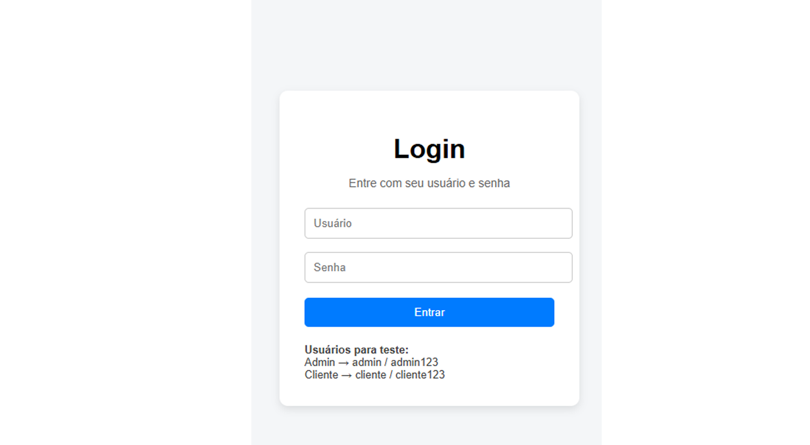
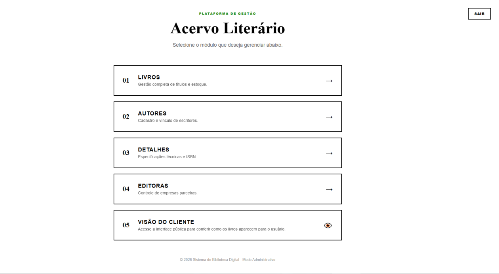
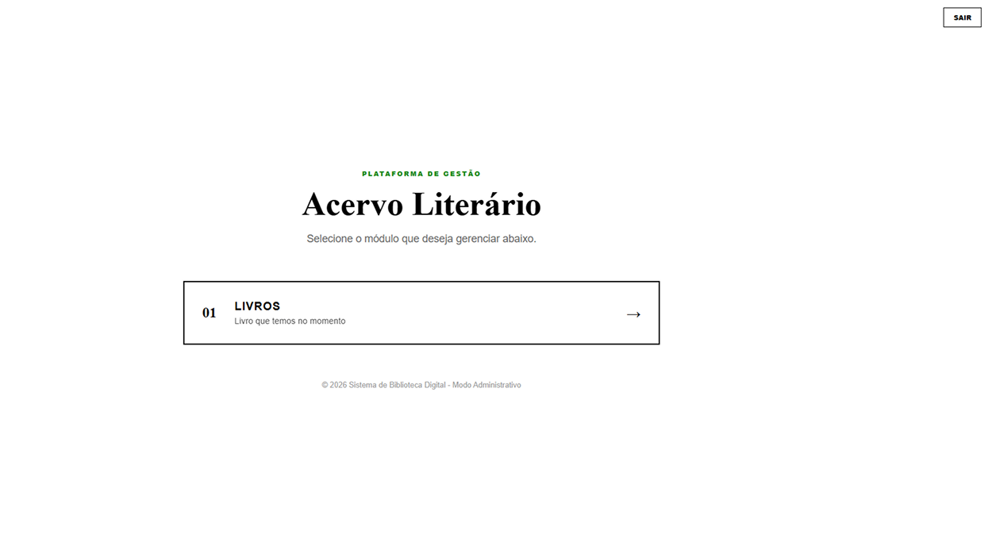
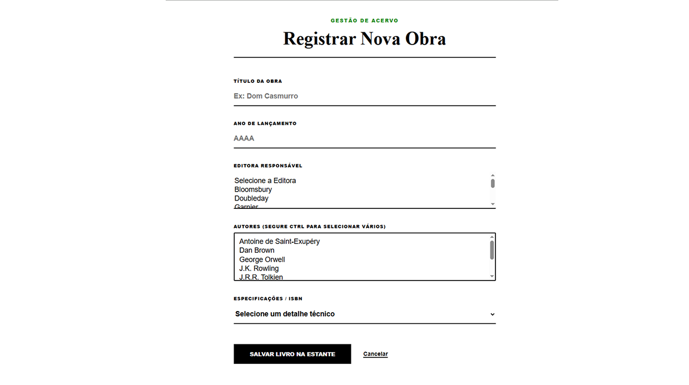
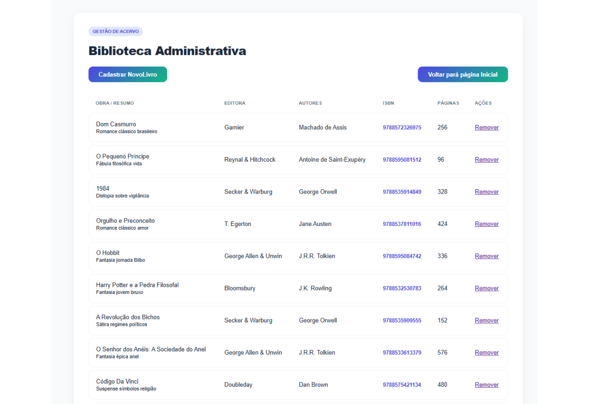

<h1 align="center"> 
	  🚀✅ { sistema-bibliotecario} - Concluído ✅🚀
</h1>

 <a href="#-Descrição-do-entregável">Descrição do Entregável</a> •
 <a href="#sobre-o-projeto">Sobre</a> •
 <a href="#funcionalidades">Funcionalidades</a> •
 <a href="#layout">Layout</a> • 
 <a href="#como-executar-o-projeto">Como executar</a> • 
 <a href="#tecnologias">Tecnologias</a> • 
 <a href="#autor">Autor</a> • 
 <a href="#user-content--licença">Licença</a>
<a href="#Popular-o-Banco-de-Dados">Popular o Banco de Dados</a>

## Sobre o Projeto

Sistema bibliotecário web desenvolvido com Java, Spring MVC e Thymeleaf para gerenciamento de livros, autores e editoras.

A aplicação permite cadastrar livros com múltiplos autores, editora e detalhes como ISBN e número de páginas, utilizando relacionamentos entre entidades e integração com banco de dados relacional.

Além das funcionalidades de CRUD completo, o projeto também possui autenticação de usuários e controle de acesso por perfil com Spring Security, separando permissões entre administradores e clientes.

## Funcionalidades

- Cadastro de livros
- Cadastro de autores
- Cadastro de editoras
- Cadastro de detalhes dos livros
- Relacionamento entre livros e autores
- Relacionamento entre livros e editoras
- Autenticação de usuários
- Controle de acesso por perfil (ADMIN e CLIENTE)
- Área separada para administrador e cliente
- Validação de campos obrigatórios
- Tratamento de exceções

  ## Layout

### Tela de Login

---

### Home do Administrador

---

### Home do Cliente

> A interface da área do cliente pode já ter sofrido alterações e melhorias visuais desde a captura desta imagem.

---

### Cadastro de Livros

---

### Listagem de Livros

##  Como Executar o Projeto 

###  Clonar o repositório

	https://github.com/Joao-vitorSantos08/sistema-bibliotecario.git

2️⃣ Acessar a pasta do projeto

	cd sistema-bibliotecario

3️⃣ Configurar o banco de dados

Abra o arquivo application.properties e configure:

	spring.datasource.url=jdbc:mysql://localhost:3306/sistema-bibliotecario
	spring.datasource.username=seu_usuario
	spring.datasource.password=sua_senha

⚠️ Certifique-se de que o MySQL esteja rodando e que o banco sistema-bibliotecario já tenha sido criado.

4️⃣ Executar o projeto

No Eclipse:

Clique com o botão direito no projeto

Selecione Run As → Java Application

# Acessar no navegador

A aplicação estará disponível em:

http://localhost:8080/login

## Pré-requisitos

Antes de começar, você vai precisar ter instalado em sua máquina:

- ☕ Java 17  
- 🐬 MySQL  
- 🔧 Eclipse IDE (ou outra IDE Java de sua preferência)  
- 🌐 Um navegador web moderno  

### Importante

Se você não estiver utilizando uma IDE que já possua suporte ao Maven integrado (como o Eclipse), será necessário instalar o:

- 🛠 [Apache Maven](https://maven.apache.org/download.cgi)

## Popular o Banco de Dados

O projeto possui um script SQL com dados prontos para testes.

Clique no arquivo abaixo para acessar:

[database/populacao_banco.sql](populacao_banco.sql)
Depois de abrir, copie o conteúdo e cole no seu banco de dados para executar o script.

## Tecnologias

- Java 17  
- Spring MVC
- MySQL  
- Thymeleaf  
- HTML & CSS  
- Maven  
- Eclipse  
- Git & GitHub  

## Como contribuir para o projeto

1. Faça um **fork** do projeto.
2. Crie uma nova branch com as suas alterações: `git checkout -b my-feature`
3. Salve as alterações e crie uma mensagem de commit contando o que você fez: `git commit -m "feature: My new feature"`
4. Envie as suas alterações: `git push origin my-feature`
> Caso tenha alguma dúvida confira este [guia de como contribuir no GitHub](./CONTRIBUTING.md)

---

## Autor

<a href="https://br.linkedin.com/in/Joao-vitorSantos08">
João Vitor Santos souza</a>
  
 

---

## Licença

Este projeto esta sobe a licença [MIT](./LICENSE).

Feito por João Vitor Santos Souza👋🏽
